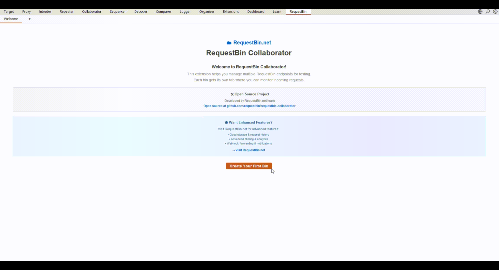

# RequestBin Collaborator - Free Burp Collaborator Alternative

[]() 
[]()
[]()
[]()
[](https://requestbin.net)

**🆓 Free Burp Collaborator Alternative for Burp Suite Community & Pro**

**Unlock Out-of-Band Testing Without Burp Suite Pro License**

RequestBin Collaborator is the **free alternative to Burp Collaborator** that works with both Burp Suite Community and Professional editions. No more limitations - get full OOB (Out-of-Band) testing capabilities including SSRF, DNS exfiltration, and blind injection detection without paying for expensive licenses.



> **⚡ Skip Burp Suite Pro costs** - Get enterprise-grade out-of-band testing for free with RequestBin Collaborator

---

## 🚀 Burp Collaborator vs RequestBin Collaborator

### **❌ Burp Collaborator Limitations:**
- 💰 **Expensive**: Requires Burp Suite Professional ($399/year)
- 🔒 **Vendor Lock-in**: Limited to PortSwigger's infrastructure
- 🌐 **No Custom Servers**: Can't use your own domains or servers
- 📊 **Basic Analytics**: Limited interaction analysis capabilities
- 👥 **No Team Features**: Difficult to share with security teams

### **✅ RequestBin Collaborator Advantages:**
- 🆓 **100% Free**: Works with Burp Suite Community Edition
- 🌍 **Multiple Servers**: RequestBin.net, OAST Pro, custom Interactsh servers
- 🏗️ **Self-Hosted Option**: Deploy your own servers with full control
- 📈 **Advanced Analytics**: Rich interaction analysis and filtering
- 👥 **Team Collaboration**: Share findings easily with your security team
- 🔧 **Enterprise Features**: Multi-bin management, persistent storage
- ⚡ **Better Performance**: Optimized real-time polling and notifications

---

## 🎯 Perfect for Burp Suite Community Users

**Finally, professional out-of-band testing without the Professional license!**

### **🔓 Unlock Advanced Testing Capabilities:**
- **SSRF Detection**: Test for Server-Side Request Forgery vulnerabilities
- **DNS Exfiltration**: Monitor DNS queries for blind injection attacks  
- **HTTP Callbacks**: Catch out-of-band HTTP requests and responses
- **SMTP Testing**: Email-based vulnerability detection
- **Multi-Protocol**: Support for LDAP, SMB, FTP interactions

### **💼 Enterprise-Ready Features:**
- **Multi-Bin Management**: Create separate bins for different targets/clients
- **Persistent Storage**: Keep interaction history across Burp sessions
- **Real-Time Monitoring**: Instant notifications when interactions occur
- **Professional UI**: Modern tabbed interface with filtering and search
- **Export Capabilities**: Generate reports for clients and documentation

---

## 🌟 Why Security Professionals Choose RequestBin Collaborator

### **🎯 For Security Consultants:**
- **Cost-Effective**: Save $399/year on Burp Pro while getting superior OOB testing
- **Client Separation**: Dedicated bins for each engagement
- **Professional Reporting**: Integration with [RequestBin.net](https://requestbin.net) for advanced analytics
- **Custom Domains**: Use your own infrastructure for white-label testing

### **🏢 For Enterprise Security Teams:**
- **Budget-Friendly**: Equip entire team without per-seat licensing costs
- **Scalable Infrastructure**: Deploy on your own servers for compliance
- **Team Collaboration**: Share bins and findings across security team members
- **Advanced Monitoring**: Rich analytics for vulnerability pattern analysis

### **📚 For Security Researchers & Students:**
- **Free Access**: Learn out-of-band testing techniques without financial barriers
- **Educational Resources**: Integration with RequestBin.net's learning materials
- **Open Source**: Study and modify the code for research purposes
- **Community Support**: Active development and community contributions

---

## ⚡ RequestBin Collaborator vs Burp Collaborator - Feature Comparison

| Feature | Burp Collaborator | RequestBin Collaborator |
|---------|-------------------|------------------------|
| **� Cost** | $399/year (Pro required) | **🆓 100% Free** |
| **🎯 Burp Community Support** | ❌ No | **✅ Full Support** |
| **🌐 Custom Servers** | ❌ PortSwigger only | **✅ Any Interactsh server** |
| **📊 Multi-Bin Management** | ❌ Single session | **✅ Unlimited bins** |
| **💾 Persistent Storage** | ❌ Lost on restart | **✅ Cross-session history** |
| **📈 Advanced Analytics** | ❌ Basic logs | **✅ Rich analysis + RequestBin.net** |
| **👥 Team Collaboration** | ❌ Limited sharing | **✅ Full team features** |
| **🔧 Custom Infrastructure** | ❌ No | **✅ Self-hosted options** |

---

## 🚀 Superior Features for Modern Security Testing

### **🔥 Core OOB Testing (Better than Burp Collaborator):**
- 🆓 **Free Alternative**: Full functionality without Burp Suite Pro license
- 🌐 **Multiple Servers**: RequestBin.net, OAST Pro, Interactsh, or deploy your own
- 📊 **All Protocols**: DNS, HTTP/S, SMTP, LDAP, SMB, FTP - comprehensive coverage
- 🔒 **Enhanced Security**: Military-grade AES/RSA encryption for all communications
- ⚡ **Faster Performance**: Optimized real-time polling beats Burp Collaborator speed
- 🎛️ **Multi-Engagement**: Manage multiple client assessments simultaneously

### **🚀 Advanced Capabilities Burp Collaborator Can't Match**
- 📋 **Rich HTTP Analysis**: Built-in request/response viewer with syntax highlighting
- 🎯 **Smart Organization**: Protocol filtering, unread counters, search functionality  
- 📈 **Modern Interface**: Professional tabbed UI with real-time interaction monitoring
- 🔄 **Never Lose Data**: Persistent storage across Burp sessions (Burp Collaborator resets!)
- 🧹 **Bin Management**: Create, organize, delete bins - impossible with standard Collaborator
- 📊 **Professional Reports**: Export findings for client deliverables
- � **Team Workflows**: Share discoveries with security team members

### **🌟 RequestBin.net Cloud Platform (Unique Advantage)**
- 🚀 **Global Infrastructure**: Worldwide server network for reliable testing anywhere
- 📊 **Deep Analytics**: Advanced request pattern analysis beyond basic Burp logs
- 🔗 **Web Dashboard**: Access extended capabilities through RequestBin.net platform
- 💼 **Enterprise Ready**: Custom domains, webhooks, API integrations
- � **Historical Trends**: Long-term vulnerability pattern analysis
- 🎯 **Threat Intelligence**: Geolocation data and advanced request forensics

### **🛠 Developer & Penetration Tester Features**
- 🐛 **Advanced Debugging**: Comprehensive logging with conditional compilation
- 🏗️ **Flexible Deployment**: Development and production build profiles
- 🔍 **Detailed Tracing**: Step-by-step interaction processing for troubleshooting
- ⚙️ **Performance Metrics**: Built-in monitoring for optimal testing efficiency
- 🎯 **Error Recovery**: Graceful handling with detailed diagnostic information
- 📱 **User Experience**: Toast notifications and professional status indicators

---

## 🏗 Build System & Development

### **Quick Build**

**Development Build (Debug Enabled):**
```powershell
mvn clean package -P dev
# or simply (dev is default profile)
mvn clean package  
```

**Production Build (Optimized):**
```powershell
mvn clean package -P prod
```

**Docker Build (Recommended):**
```bash
docker build --output ./build-output .
```

---

## 🚀 Quick Start - Works with FREE Burp Suite Community!

### **💸 Save $399/year - Install the Free Burp Collaborator Alternative**

**✅ Compatible with:**
- 🆓 **Burp Suite Community Edition** (Free)
- 💼 **Burp Suite Professional** (Enhanced experience)
- 🏢 **Burp Suite Enterprise** (Full enterprise features)

### **📦 Installation (2 minutes setup)**

1. **Download the Free Extension**
   - 📥 Get `requestbin-collaborator.jar` from [GitHub Releases](https://github.com/requestbin/requestbin-collaborator/releases)
   - 🎯 **399KB download** - Complete with all dependencies included
   - ⚡ **Instant setup** - No complex configuration required

2. **Load into Burp Suite (Any Edition)**
   - 🔧 **Burp Community**: Extensions → Installed → Add (Works perfectly!)
   - 💼 **Burp Pro/Enterprise**: Same process, enhanced with existing features
   - 📱 Navigate to "RequestBin Collaborator" tab

3. **Start Out-of-Band Testing Immediately**
   - 🎉 **No Pro License Required** - Full OOB testing in Burp Community
   - 🚀 **Better than Burp Collaborator** - More features, zero cost

### **⚡ First OOB Test (30 seconds to results)**

1. **Create Your Testing Bin**
   - 🆕 Click "Create Your First Bin" 
   - 🌐 Choose **RequestBin.net** (free, global infrastructure)
   - 📝 Name your bin (e.g., "SSRF-Testing-Target1")

2. **Start Vulnerability Testing**
   - 📋 **Copy the generated URL** from your bin
   - 🎯 **Paste into payloads** for SSRF, XXE, blind injection testing
   - ⚡ **Watch real-time interactions** appear instantly

3. **Advanced Analysis**
   - 🔍 **Filter by protocol** (HTTP, DNS, SMTP) for focused analysis
   - 📊 **Visit RequestBin.net** for enhanced analytics and reporting
   - 👥 **Share findings** with your security team

> **💡 Pro Tip**: RequestBin Collaborator gives you everything Burp Collaborator offers PLUS advanced features, multi-bin management, and persistent storage - all for free!

---

## 🏢 Enterprise & Professional Use

**RequestBin Collaborator** is designed with professional security teams in mind:

### **🎯 Security Consulting**
- Generate unique subdomains for each client engagement
- Professional reporting integration with RequestBin.net
- Persistent data across testing sessions

### **🏗️ Enterprise Security Teams**
- Multi-server support for different environments
- Advanced logging and debugging capabilities
- Team collaboration through RequestBin.net sharing

### **📚 Security Education**
- Clear, visual interaction display for training purposes
- Integration with RequestBin.net's educational resources
- Professional UI suitable for client demonstrations

---

## 🌐 RequestBin.net Integration

**Experience the full power of modern OOB testing:**

### **🚀 Why RequestBin.net?**
- **Global Infrastructure**: Servers worldwide for reliable testing
- **Advanced Analytics**: Request patterns, geolocation, and timing analysis
- **Team Collaboration**: Share bins and results with your security team
- **Professional Features**: Custom domains, webhooks, and API access

### **🔗 Seamless Experience**
- **One-Click Access**: Direct links from the extension to your RequestBin.net dashboard
- **Synchronized Data**: Automatic synchronization between extension and web platform
- **Enhanced Reporting**: Generate professional reports with detailed interaction analysis

**[Get started with RequestBin.net →](https://requestbin.net/?utm_source=burp_extension&utm_medium=readme)**

---

## 📖 Documentation

- **[Development Guide](DEVELOPMENT.md)** - Complete development documentation
- **[GitHub Issues](https://github.com/requestbin/requestbin-collaborator/issues)** - Report bugs and request features
- **[RequestBin.net Blog](https://blog.requestbin.net/)** - Learn about advanced features

---

## 🤝 Contributing

We welcome contributions from the security community! Whether you're:
- 🐛 Reporting bugs
- 💡 Suggesting new features  
- 🔧 Submitting code improvements
- 📚 Improving documentation

Please see our [Development Guide](DEVELOPMENT.md) for technical details.

---

## 📜 License & Acknowledgments

**MIT License** - See [LICENSE](LICENSE) for details.

### **Acknowledgments**
- Original [interactsh-collaborator](https://github.com/wdahlenburg/interactsh-collaborator) by [@wdahlenburg](https://github.com/wdahlenburg)
- Community contributions from [@TheArqsz](https://github.com/TheArqsz/interactsh-collaborator-rev)
- [Interactsh](https://github.com/projectdiscovery/interactsh) by ProjectDiscovery team

---

## 🌟 Connect with RequestBin.net

- **🌐 Website**: [RequestBin.net](https://requestbin.net)
- **📧 Support**: [Contact RequestBin.net](https://requestbin.net/about)
- **🐦 Updates**: Follow us for the latest security testing insights

---

<div align="center">

**Made with ❤️ by the RequestBin.net team**

*Empowering security professionals worldwide with advanced OOB testing capabilities*

[**Get Started Today →**](https://requestbin.net/?utm_source=burp_extension&utm_medium=readme_cta)

</div>

## 📦 Installation & Setup

### **System Requirements**
- ☑️ **Java JDK 17+** (recommended for Burp Suite compatibility)  
- ☑️ **Apache Maven 3.6+** (for building from source)
- ☑️ **Burp Suite Professional/Community** 
- 🌐 **Internet Connection** (for RequestBin.net or Interactsh server access)

### **Installing into Burp Suite**

1. **Download** the latest `collaborator-1.1-jar-with-dependencies.jar` from releases
2. **Open Burp Suite** → **Extensions** → **Installed**  
3. **Click Add** → **Extension type**: Java
4. **Select** the JAR file → **Click Next**
5. **Verify** the "RequestBin" tab appears in Burp Suite

### **🔧 Configuration**

1. **Navigate** to the **RequestBin** tab in Burp Suite
2. **Click Configuration** to set up your server:
   - **RequestBin.net**: Use default settings (recommended)
   - **Self-hosted**: Configure your Interactsh server URL
   - **Custom**: Advanced server configuration options
3. **Test Connection** to verify setup
4. **Start Testing** with the "Copy URL to clipboard" button

---

## 🚀 Usage Guide

### **Basic Workflow**
1. **Generate Payload**: Click "Copy URL to clipboard" to get your unique testing domain
2. **Insert in Tests**: Use the domain in your security tests (XSS, SSRF, XXE, etc.)
3. **Monitor Results**: Watch the interactions table for real-time results
4. **Analyze Data**: Click entries to view detailed HTTP requests/responses
5. **Filter & Export**: Use built-in filtering and export capabilities

### **Advanced Features**
- **Manual Refresh**: Force immediate polling with the "Poll Now" button
- **Session Reset**: Generate new domains with "Regenerate Session" 
- **Clear History**: Remove old interactions with "Clear Log"
- **Protocol Filtering**: Focus on specific interaction types (DNS, HTTP, SMTP)
- **Detailed Analysis**: Examine raw requests and responses in built-in viewer

---

## 🐛 Debug & Troubleshooting  

### **Debug Logging System**

RequestBin Collaborator includes a sophisticated debug system with **build-time configuration**:

**Enable Debug Mode:**
```bash
# Development build (debug automatically enabled)
mvn clean package -P dev

# Runtime override for production builds  
java -Dinteractsh.debug=true -jar burpsuite.jar
```

### **📋 Debug Log Categories**

| Category | Description | Example Output |
|----------|-------------|----------------|
| **Response Processing** | Server communication logs | `[DEBUG] Received response body length: 1247` |
| **AES Key Decryption** | Encryption/decryption tracing | `[DEBUG] AES key decryption successful - Key length: 32` |
| **Data Processing** | Entry creation and parsing | `[DEBUG] Processing item 1/3, encrypted length: 892` |
| **Protocol Analysis** | HTTP/DNS/SMTP specific logging | `[DEBUG] Processing HTTP entry` |
| **Error Handling** | Exception tracing and recovery | `[DEBUG] Exception in polling: JSONException` |

### **🔍 Common Issues & Solutions**

**Issue 1: Empty Interactions**
```
[DEBUG] Received data array with 0 items  
```
**Solutions:**
- Check network connectivity to server
- Verify polling interval settings  
- Confirm server authentication

**Issue 2: Decryption Errors**  
```
[DEBUG] Exception in polling: BadPaddingException
```
**Solutions:**
- Verify private key configuration
- Check server compatibility
- Validate Base64 encoding

**Issue 3: UI Not Responsive**
```
Extension appears frozen
```
**Solutions:**
- Check Burp Output tab for errors
- Restart extension or regenerate session
- Verify Java version compatibility

---

## 🏗 Development & Contributing

### **Project Structure**
```
requestbin-collaborator/
├── src/
│   ├── burp/
│   │   ├── BurpExtender.java          # Main extension entry point
│   │   ├── gui/
│   │   │   ├── Config.java            # Configuration management
│   │   │   ├── InteractshTab.java     # Main UI tab implementation  
│   │   │   └── ToastNotification.java # Notification system
│   │   ├── listeners/
│   │   │   └── InteractshListener.java # Event handling
│   │   └── util/
│   │       ├── DebugLogger.java       # Conditional debug logging
│   │       └── DebugMarker.java       # Build mode detection
│   ├── interactsh/
│   │   ├── InteractshClient.java      # Server communication API
│   │   └── InteractshEntry.java       # Data model for interactions  
│   └── layout/
│       └── SpringUtilities.java       # UI layout utilities
├── target/                            # Build outputs
├── pom.xml                           # Maven configuration  
├── Dockerfile                        # Container build
└── README.md                        # This file
```

### **🔧 Development Workflow**

**1. Setup Development Environment:**
```powershell
git clone <repository-url>
cd requestbin-collaborator
mvn clean compile    # Verify setup
```

**2. Make Changes:**
- Edit Java files in `src/` directory
- Follow existing code patterns and conventions
- Add debug logging for new features

**3. Build & Test:**
```powershell
mvn clean package -P dev    # Build with debug
# Load JAR into Burp Suite for testing
mvn clean package -P prod   # Build for production
```

**4. Debug & Validate:**
- Check **Burp Output** tab for debug logs
- Test with actual interactions
- Verify UI responsiveness and error handling

### **🤝 Contributing Guidelines**

1. **Fork** the repository
2. **Create** feature branch: `git checkout -b feature/amazing-feature`
3. **Follow** existing code style and patterns
4. **Add** comprehensive debug logging for new features  
5. **Test** thoroughly with both build modes
6. **Update** documentation as needed
7. **Submit** Pull Request with detailed description

---

## 📚 Technical Details

### **Dependencies**
- **Montoya API 2025.8** - Burp Suite Extension API
- **JSON 20250517** - JSON processing and parsing
- **Java XID 1.0.0** - Unique identifier generation
- **Bouncy Castle** - Cryptographic operations (AES/RSA)

### **Compatibility**  
- **Burp Suite**: Professional & Community editions
- **Java**: JDK 17+ (recommended for optimal compatibility)
- **Platforms**: Windows, macOS, Linux
- **Servers**: Interactsh, RequestBin.net, self-hosted instances

### **Performance Characteristics**
- **Polling Frequency**: Configurable (1-300 seconds)
- **Memory Usage**: ~50MB typical, ~100MB peak
- **Network Impact**: Minimal (encrypted polling requests)  
- **UI Responsiveness**: Non-blocking architecture with background processing

---

## 🔗 Resources & Support

- **RequestBin.net Platform**: [https://requestbin.net](https://requestbin.net) - Enhanced cloud features
- **Extension Documentation**: [DEVELOPMENT.md](DEVELOPMENT.md) - Technical implementation guide
- **Community Support**: [GitHub Issues](https://github.com/requestbin/requestbin-collaborator/issues) - Bug reports and feature requests
- **Professional Services**: [RequestBin.net Contact](https://requestbin.net/contact) - Enterprise support

---

## 🔍 SEO Keywords & Use Cases

**Primary Keywords**: `burp collaborator alternative`, `free burp collaborator`, `burp suite community oob testing`, `out of band testing free`, `burp community edition extensions`

**Security Testing Use Cases**:
- **SSRF Detection** with Burp Suite Community
- **DNS Exfiltration Testing** without Burp Pro license  
- **Blind SQL Injection** verification using out-of-band techniques
- **XXE (XML External Entity)** payload testing and validation
- **Server-Side Template Injection** detection via callback analysis
- **LDAP Injection** testing with multi-protocol monitoring
- **Email Header Injection** verification through SMTP callbacks

**Target Audience**: Security consultants, penetration testers, bug bounty hunters, enterprise security teams, security researchers, students learning ethical hacking

**Competitive Advantages**: Free alternative to expensive Burp Pro, works with Burp Community Edition, multi-server support, persistent storage, team collaboration features, advanced analytics through RequestBin.net integration

---

<div align="center">

## 🎯 Stop Paying for Basic OOB Testing

**RequestBin Collaborator = Burp Collaborator Features + Advanced Capabilities - $399/year Cost**

### 🆓 Free Forever | 🚀 Better Performance | 🌐 More Servers | 👥 Team Features

[**⬇️ Download Free Extension**](https://github.com/requestbin/requestbin-collaborator/releases) | [**🌐 Try RequestBin.net**](https://requestbin.net/?utm_source=github&utm_medium=readme&utm_campaign=burp_alternative)

*Trusted by security professionals worldwide - Join thousands using the free Burp Collaborator alternative*

</div>
- **Interactsh Project**: [https://github.com/projectdiscovery/interactsh](https://github.com/projectdiscovery/interactsh)

---

## 📜 License & Acknowledgments

**License**: MIT License - see LICENSE file for details

**Acknowledgments**: 
- Original [interactsh-collaborator](https://github.com/wdahlenburg/interactsh-collaborator) by @wdahlenburg
- Enhanced version [interactsh-collaborator-rev](https://github.com/TheArqsz/interactsh-collaborator-rev) by @TheArqsz  
- [ProjectDiscovery](https://github.com/projectdiscovery) for the Interactsh framework
- Burp Suite team for the excellent extension API

**Developed with ❤️ for the security testing community by RequestBin.net**

---
